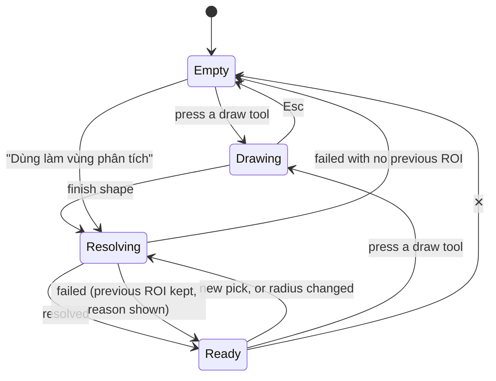

# Region of Interest and the Analysis Toolbar — Design (Phase 4)

**Date:** 2026-09-30
**Status:** Draft for review. Part 1 (§1–§7): use cases, user flows, requirements, and a consistency and UI/UX review,
every question decided (D1–D13). Part 2 (§8–§14): the design.
**Parent spec:** [2026-09-18-entity-model-networks-and-roi-design.md](2026-09-18-entity-model-networks-and-roi-design.md)
§5 (ROI as a first-class object), §10 row 4. Phases 1–3 of that spec have shipped (`8f0ac8a`).

## Decisions taken in brainstorming (2026-09-29/30)

| # | Question | Decision |
|---|---|---|
| D1 | How many ROIs at once | **One active ROI.** Setting a new one replaces it. No list, no undo |
| D2 | What an ROI may be | **An area, a line or a point.** Tools enable by kind |
| D3 | How an existing entity becomes the ROI | **An explicit "Dùng làm vùng phân tích" action.** A map click still means "inspect" |
| D4 | How a province or ward becomes the ROI | **The map popup and search**, both carrying the same action. No separate dropdown picker |
| D5 | Draw tools | **Polygon, rectangle, line, point.** No circle tool: a circle is a point plus a radius |
| D6 | Layout | **A chip above the toolbar**; the toolbar grouped by what each tool needs (Đo nhanh · Vẽ · Vùng · Tuyến · Lân cận — see U-10) |
| D7 | Where the radius lives | **On the ROI.** "Sông Thu Bồn + 5 km" becomes the ROI. The Vùng đệm tool is removed from the toolbar |
| D8 | Who resolves an ROI to geometry | **The server** (`POST /api/roi/resolve`); analysis operations take the same `roi` object |
| D9 | Quick measurement (U-1) | **Keep a "Đo nhanh" ruler**: today's two measure buttons (length, area), grouped as "Đo nhanh"; their shape is temporary and never touches the ROI |
| D10 | The river-level bug (C-1) | **Fixed now, on its own branch, before Phase 4** |
| D11 | Counting inside an admin unit (C-2) | **Stamped codes** for an admin ROI with no radius |
| D12 | "Gần nhất" (C-5) | **Measured from the ROI's centroid**, so it is available for every kind. The centroid is drawn on the map and named in the result |
| D13 | Drawing aids | **Adopted** — the set in U-11 |

---

## 1. Actors

| Actor | Access | Uses the ROI for |
|---|---|---|
| **Viewer** — hydrology staff, supervisors, the public | Unauthenticated. Every analysis endpoint is public | All use cases below |
| **Steward** — the administrator role | Signed in | The same analysis use cases, plus editing (unchanged by this phase) |
| **Assistant** — the conversational tool layer | Server-side | Not in this phase. Phase 5 moves its tools to the same `roi` object |

## 2. Use cases

Each use case names the question as a user would ask it, then what the ROI is and which tool answers it.

| ID | Question | ROI | Tool |
|---|---|---|---|
| UC-1 | "Tỉnh Đắk Lắk có bao nhiêu đập, bao nhiêu hồ?" | Admin unit: a province | Chọn trong vùng |
| UC-2 | "Xã này có những trạm quan trắc nào?" | Admin unit: a ward | Chọn trong vùng |
| UC-3 | "Những đập nào nằm trong 5 km quanh sông Thu Bồn?" | River entity + 5 km radius | Chọn trong vùng |
| UC-4 | "Dọc Quốc lộ 14, trong 2 km có những hồ nào?" | Reference entity (road) + 2 km radius | Chọn trong vùng |
| UC-5 | "Trắc diện độ cao dọc sông Ba" | River entity (a line) | Trắc diện độ cao |
| UC-6 | "Trắc diện theo tuyến tôi vẽ" | Drawn line | Trắc diện độ cao |
| UC-7 | "Độ cao thấp nhất, cao nhất, trung bình của vùng này" | Drawn area, lake, or ward | Thống kê độ cao |
| UC-8 | "Ba trạm gần đập X nhất" / "trạm gần hồ này nhất" | Dam (a point), or any ROI via its centroid | Gần nhất |
| UC-9 | "Sông này dài bao nhiêu? Vùng tôi khoanh rộng bao nhiêu?" | Any line or area | The chip's measure |
| UC-9b | "Từ đây tới đó bao xa?" — a quick check mid-analysis | None; the ROI must survive | Đo nhanh ruler |
| UC-10 | Chained: "sông Thu Bồn + 5 km → các đập trong đó → trạm gần đập lớn nhất" | River + radius, then a dam from the result list | Chọn trong vùng, then Gần nhất |
| UC-11 | "Xuất kết quả" / "in bản đồ có vùng phân tích" | Any | Existing CSV export; existing print |
| UC-12 | Start over | — | Clear the ROI |

UC-1 is the question the parent spec calls "the most common question this atlas will get".

## 3. User flows

Every flow ends in the same state: one active ROI, shown in the chip and on the map, with the tool buttons enabled
according to its kind.

**F1 — Draw an ROI.**
1. The user presses a draw button (polygon, rectangle, line or point). The chip shows a drawing hint
   ("Nhấp để vẽ · nhấp đúp để kết thúc · Esc để huỷ"). Map clicks no longer open the popup.
2. The user finishes the shape. The chip shows "Đang xác định vùng…" while the server resolves it.
3. The chip shows the label ("Hình vẽ"), kind and measure. The previous ROI, if any, is gone.

**F2 — Pick from search.**
1. The user types a name. Results include layer features, reference entities and now admin units.
2. Each result has "Dùng làm vùng phân tích". Pressing it resolves the ROI and fits the map to it.

**F3 — Pick from the map popup.**
1. The user clicks the map. The popup shows what was hit, as today, and a section "Dùng làm vùng phân tích" listing
   every candidate at that point, most specific first: the thematic feature (for a river way, the whole river), the
   basemap entity (a named road, railway or water body), the ward (from zoom 10, where the ward layer loads), and the
   province.
2. Pressing a candidate resolves it and fits the map to it.

**F4 — Pick from a result.** A row in a result card (a dam from "Chọn trong vùng", a station from "Gần nhất") has
the same action.

**F5 — Add, change or remove a radius.** Offered only while the ROI is a line or a point.
1. The user presses "Bán kính" on the chip, picks a preset (1, 2, 5, 10 km) or types a value, and confirms.
2. The ROI becomes "<label> + 5 km", an area; the map redraws the buffered shape; the area tools enable.
3. Removing the radius returns the ROI to the original line or point.

**F6 — Run a tool.**
1. The user presses an enabled tool. The panel above the chip shows only that tool's parameters and "Chạy".
2. The result card shows the answer and names the ROI it was computed for ("Kết quả cho: Sông Thu Bồn + 5 km").
3. Changing the ROI afterwards leaves the card in place, still naming the ROI it belongs to, until it is cleared or a
   tool runs again.

**F7 — Clear.** ✕ on the chip removes the ROI and its outline; the tools disable; results are untouched.

**F7b — Quick measurement.** The user presses one of the two "Đo nhanh" buttons (length or area), draws, and reads the live length or area.
The shape disappears when the ruler is closed or another tool is chosen. The ROI, its outline and the tool buttons are
untouched throughout.

**F8 — Failure.** If resolving a new ROI fails (too large, outside the working region, entity no longer exists), the
previous ROI stays active and the chip shows the reason. If a tool run fails, the panel shows the reason and the ROI
is untouched.



## 4. Requirements

### 4.1 Functional

| ID | Requirement |
|---|---|
| FR-1 | There is at most one active ROI. Setting one replaces the previous one. |
| FR-2 | An ROI is set from exactly four sources: a drawing (polygon, rectangle, line, point); a layer feature; a reference entity; an admin unit (province or ward). |
| FR-3 | An ROI has a kind — area, line or point — derived by the server from its resolved geometry. |
| FR-4 | A line or point ROI may carry a radius (0 < r ≤ 100 km), which makes it an area. An area ROI never carries one. |
| FR-5 | The chip shows the ROI's label, kind, and measure: length in km for a line, area in km² for an area. |
| FR-6 | The ROI is drawn on the map in its own style, distinct from both the drawing sketch and result highlights, and is not removed by clearing results. |
| FR-7 | Every tool's availability is a pure function of the ROI (kind, size) and the tool. A disabled tool shows the reason, naming what would enable it. |
| FR-8 | Area tools (Chọn trong vùng, Thống kê độ cao) need an area; the path tool (Trắc diện độ cao) needs a line; Gần nhất works on any ROI, measuring from its centroid (D12), which is drawn on the map and named in the result ("tính từ trọng tâm"). A point ROI's centroid is the point itself. |
| FR-9 | Every analysis operation takes the ROI as it is; nothing is drawn per tool. |
| FR-10 | A result card names the ROI it was computed for. |
| FR-11 | "Dùng làm vùng phân tích" is offered on map-popup candidates, search results, and result-card rows. |
| FR-12 | Search returns provinces and wards by name. |
| FR-13 | Clicking a river on the map offers the whole river (its level-1 entity), not the way that was hit. |
| FR-14 | A failed resolve keeps the previous ROI and shows the reason in the chip. |
| FR-15 | The ROI lives for the page session only; it is not persisted across reloads. |
| FR-16 | The Vùng đệm button is removed from the toolbar. The two measure buttons stay, grouped as "Đo nhanh"; their shape is temporary and never becomes, replaces or clears the ROI (D9). |
| FR-17 | "Chọn trong vùng" over an admin ROI with no radius counts by the stamped `province_codes` / `ward_codes`, the same method as the assistant's `features_in_admin_unit` (D11). Every other ROI is counted geometrically. |
| FR-18 | Drawing an ROI or a ruler shape offers the aids in U-11. |

### 4.2 Non-functional

| ID | Requirement |
|---|---|
| NFR-1 | **Performance.** The tested worst cases — the largest province (Lâm Đồng, 24,246 km²) and a long river + 10 km — resolve and run end to end inside the 5-second analysis budget, from a cold connection. The enforced bound stays the 5-second timeout per SQL statement: a per-request deadline needs PostgreSQL 17's `transaction_timeout`, and the database runs 16. |
| NFR-2 | **Limits.** Every existing limit (source vertices and parts, 25,000 km² ROI area, 5,000 km² for elevation statistics, working-region clip) applies identically at resolve time and at run time, so the chip never shows an ROI a tool will refuse without saying so. |
| NFR-3 | **Security.** Resolve runs like the analysis operations: public, read-only transaction, statement timeout, on the dedicated analysis pool. |
| NFR-4 | **Accessibility.** Every control is reachable by keyboard; a disabled tool's reason is available on hover **and** on focus; Esc cancels a drawing and closes the radius editor. |
| NFR-5 | **Language.** All interface text is Vietnamese and uses one term, "vùng phân tích", for the ROI. |
| NFR-6 | **Narrow screens.** The layout works at 360 px wide: the chip truncates its label, never its measure, and the toolbar drops group labels before it drops buttons. |
| NFR-7 | **Consistency of answers.** The same question gets the same number wherever it is asked (toolbar, assistant, layer list). |

---

## 5. Consistency review

Each finding checks the agreed design (D1–D8) against the requirements, the parent spec and the code as it stands.
Measurements were taken on 2026-09-30 against the development database.

**C-1 — Rivers are counted at all three levels by every consumer except search and the map.** *Blocker; a live bug
on `main`.* Phase 3 made level filtering each consumer's job, but only search, the detailed map layer and the editor
were updated. "Chọn trong vùng" over Đắk Lắk reports **2,991** "sông ngòi" — 142 rivers, 2,202 reaches and 647 ways —
where the answer is 142. The assistant's `features_in_admin_unit`, "Gần nhất" over rivers, and
`GET /api/layers/rivers/features` share the defect. UC-1 and UC-3 give wrong answers until this is fixed, and it
violates NFR-7.
*Resolution (D10):* fixed on its own branch **before** Phase 4, since it affects shipped features: every analysis and
assistant query over `rivers` means level 1 (the entity), and the layer-list endpoint reads `rivers_detail`.
**Done 2026-09-30, merged as `0dd5e19`:** one `entityPredicate(key)` in `assistant/tools/data/helpers.ts`, applied by
select_within, nearest, features_in_admin_unit, features_in_view, related_features, filter_by_attribute and search;
`run_sql`'s description names the levels. Đắk Lắk now reports 142 rivers.

**C-2 — "Chọn trong vùng" over the largest province exceeds the budget.** Lâm Đồng takes **6.3 s** (Đắk Lắk 2.3 s):
the per-statement timeout lets a multi-layer query through that breaks NFR-1. It also answers "how many dams in this
province" by polygon intersection against a boundary simplified to ~11 m, while the assistant answers the same
question from the stamped `province_codes` — two methods that can disagree for features near a border (NFR-7).
*Resolution (D11, FR-17):* for an admin ROI with no radius, "Chọn trong vùng" filters by the stamped codes (indexed,
and the same method as the assistant). Every other ROI keeps the geometric path. Re-measured after the C-1 fix: Lâm
Đồng takes **5.2 s on a cold cache** and 2.2 s warm (Đắk Lắk 2.1–2.5 s), so the geometric path alone still breaks
NFR-1 for the largest province and the stamped-code path is needed. Lâm Đồng + a radius stays the NFR-1 test for the
geometric path.

**C-3 — Elevation statistics refuses every province.** `MAX_ZONAL_AREA_KM2` is 5,000 km²; the six provinces are
12,186–24,246 km². Raising the limit is not an option — 24,000 km² is some 27 million DEM pixels, far outside the
budget. Wards (largest 4,208 km²) all fit.
*Recommendation:* keep the limit; tool availability (FR-7) takes the ROI's area into account, so the button is
disabled on a province with the reason "Vùng 18.086 km² vượt giới hạn 5.000 km² của thống kê độ cao".

**C-4 — Clicking a river on the map would recreate the defect Phase 3 removed.** The detailed river layer is level 3,
so a click hits one OSM way; using it as the ROI would analyse a fragment of the river. *Resolution:* FR-13 — the
popup offers the way's level-1 river ("Sông Thu Bồn (cả sông)"), resolved server-side from its
`parent_external_id`. An unnamed way, which has no river, is offered as itself.

**C-5 — A point with a radius can no longer use "Gần nhất".** By D2 and D7, "đập X + 5 km" is an area, so the
point-only tool disables — surprising when the ROI plainly started as a dam.
*Resolution (D12):* "Gần nhất" measures from the ROI's centroid, so it is available for every kind; a point's centroid
is the point, so "đập X + 5 km" still searches from the dam. A centroid can fall outside a curved river or an L-shaped
area, so the point used is drawn on the map and the result card says "tính từ trọng tâm".

**C-6 — Results outlive the ROI they answer.** Picking a dam from a result list (F4) changes the ROI while the card
still shows the previous query. *Resolution:* FR-10 and F6 step 3 — the card names its own ROI.

**C-7 — The ward is only pickable from the popup at zoom 10 and above**, because the ward layer loads from there.
*Resolution:* accepted and documented in F3; search reaches any ward at any zoom.

**C-8 — Departures from the parent spec §5**, to be recorded in part 2: the `result` source is dropped (chaining goes
through the radius and result-row actions); "Vùng đệm" and "Đo diện tích / Đo chiều dài" are no longer tools (the
radius and the chip replace them); the single `entity` source is split into `feature` and `reference`, matching the
API's two identifier spaces.

**C-9 — The `buffer` operation must stay server-side.** The assistant's `buffer_feature` tool depends on it, and the
shared `ANALYSIS_OPS` list still contains it. The web app therefore builds its toolbar from its own list rather than
from `ANALYSIS_OPS`.

**C-10 — Radius and the area cap.** A long road plus a radius can exceed 25,000 km²; so can Lâm Đồng, but an admin
unit is an area and is never offered a radius (FR-4). The resolve error must quote both figures (FR-14).

---

## 6. UI/UX review

**U-1 — Removing the measure buttons would make a quick measurement destroy the ROI.** Measuring the distance
between two points would be "draw a line", replacing the current ROI — painful halfway through UC-10.
*Resolution (D9, FR-16, F7b):* one "Đo nhanh" ruler whose shape is temporary and never touches the ROI.

**U-2 — Disabled buttons must still explain themselves.** A native `disabled` button receives neither focus nor, in
several browsers, hover, so its tooltip is unreachable (NFR-4). *Resolution:* tools use `aria-disabled` and remain
focusable; pressing one shows its reason instead of running.

**U-3 — The chip needs explicit states:**

| State | Chip shows |
|---|---|
| Empty | "Chưa có vùng phân tích — vẽ một hình, hoặc chọn một đối tượng trên bản đồ hay trong tìm kiếm" |
| Drawing | The drawing hint for the active shape |
| Resolving | "Đang xác định vùng…" with a spinner; the previous ROI stays visible |
| Ready | Label · kind · measure · [Bán kính] (lines and points only) · [✕] |
| Error | The previous ROI (or Empty) plus the reason, dismissible |

**U-4 — Radius entry** is an inline editor in the chip: presets 1, 2, 5 and 10 km, a number field, Enter to apply,
Esc to cancel, km only, a maximum of 100.

**U-5 — Fitting the map.** Fit to the ROI when it comes from search, the popup or a result row (it may be off screen);
never for a drawing (it is on screen by construction); on a radius change, only if the buffered area leaves the
viewport.

**U-6 — The popup stays short.** One section at the bottom, "Dùng làm vùng phân tích:", holds one compact row per
candidate, most specific first, each labelled with its kind ("Sông Thu Bồn · sông", "Xã Ea Kar · xã",
"Đắk Lắk · tỉnh").

**U-7 — Three visual styles that cannot be confused.** Today the drawing sketch and the analysis input both use a dark
dashed line. *Resolution:* the sketch is blue while drawing; the committed ROI is a dark dashed outline with a faint
fill; results keep today's highlight colours.

**U-8 — Stacking above the toolbar**, bottom to top: toolbar, chip, then the tool panel or result card. The chip never
moves when a panel opens.

**U-9 — Narrow screens** (NFR-6): below 600 px the toolbar hides its group labels (Vẽ, Vùng, Tuyến, Điểm) and keeps
the dividers; the chip shows the label with an ellipsis and the measure in full.

**U-10 — One vocabulary.** "Vùng phân tích" for the ROI in every place; "Bán kính" for the radius; the toolbar groups
are "Đo nhanh", "Vẽ", "Vùng", "Tuyến", "Lân cận" — not "Điểm", since D12 makes Gần nhất available for every kind; every
disabled-tool reason names the fix ("Thêm bán kính để dùng cho đường này", "Cần một đường, ví dụ một con sông").

**U-11 — Drawing aids (D13, FR-18).** They apply to both ROI drawing and the ruler.

| Aid | Behaviour |
|---|---|
| Visible snap-to-close | OpenLayers already closes a polygon when the user clicks within 12 px of its first vertex, but gives no cue. The first vertex is enlarged and highlighted while the cursor is inside that tolerance, and the chip hint changes to "Nhấp để khép vùng". The tolerance rises to 20 px on touch input. |
| Snap to features | The cursor snaps to vertices and edges of the visible thematic layers and of the current ROI, within 10 px, so a river bank or a lake shore can be traced. Holding Alt draws freely. |
| Live measure | The chip shows the running length (line) or area (polygon) while drawing, and the length of the segment being drawn. |
| Undo a vertex | Backspace removes the last vertex; with none left, it cancels the drawing. |
| Finish and cancel | Double-click or Enter finishes; Esc cancels. The chip hint states all three. |
| Rectangle | Two clicks at opposite corners, with the rectangle drawn live between them. |
| Freehand | Holding Shift while dragging draws freehand (the OpenLayers default, now named in the hint). |
| Invalid shapes | A self-intersecting polygon is refused when finished, with "Vùng tự cắt nhau — hãy vẽ lại", rather than sent to the server. |

Editing the vertices of a finished drawing is **not** included: redrawing is cheap, and editing would need its own
modes and undo.

---

## 7. Open questions

None. Q-1 to Q-4 of the first draft are resolved as D9 to D12; the drawing aids are D13.

---

# Part 2 — Design

## 8. Interaction model

**The toolbar**, left to right:

| Group | Buttons | Notes |
|---|---|---|
| — | Di chuyển bản đồ | Unchanged |
| Đo nhanh | Đo chiều dài, Đo diện tích | Today's two measure buttons, kept as the ruler (D9). Their shape is temporary and never touches the ROI |
| Vẽ | Đa giác, Hình chữ nhật, Đường, Điểm | Each draws a new ROI (F1) |
| Vùng | Chọn trong vùng, Thống kê độ cao | Area tools |
| Tuyến | Trắc diện độ cao | Path tool |
| Lân cận | Gần nhất | From the ROI's centroid (D12) |
| — | Zoom, Về vùng công tác, basemaps | Unchanged |

The Vùng đệm button is gone (D7). The chip sits directly above the toolbar; a tool's panel or result card sits above
the chip (U-8).

**Tool availability** (FR-7) is one pure function of the tool and the resolved ROI:

| Tool | No ROI | Area | Line | Point |
|---|---|---|---|---|
| Chọn trong vùng | "Chưa có vùng phân tích" | ✓ | "Thêm bán kính để dùng cho đường này" | "Thêm bán kính để dùng cho điểm này" |
| Thống kê độ cao | "Chưa có vùng phân tích" | ✓ up to 5,000 km², else "Vùng N km² vượt giới hạn 5.000 km² của thống kê độ cao" | "Cần một vùng — thêm bán kính" | "Cần một vùng — thêm bán kính" |
| Trắc diện độ cao | "Chưa có vùng phân tích" | "Cần một đường, ví dụ một con sông" | ✓ | "Cần một đường, ví dụ một con sông" |
| Gần nhất | "Chưa có vùng phân tích" | ✓ from the centroid | ✓ from the centroid | ✓ from the point |

A disabled tool stays focusable (`aria-disabled`); hovering or focusing it shows its reason, and pressing it shows the
reason in the chip instead of opening a panel (U-2).

**Setting the ROI.** Every source goes through one store action, `setRoi(roi)`, which resolves on the server and then
updates the chip and the map. The map is fitted to the ROI when it comes from search, the popup or a result row, and not
for a drawing (U-5). A radius change refits only if the buffered shape leaves the viewport.

**Running a tool.** The panel shows only the tool's own parameters — layers for Chọn trong vùng, sample count for
Trắc diện, layer and k for Gần nhất — and "Chạy". There is no draw step and no "Dùng hình vừa vẽ". The result card's
header reads "Kết quả cho: <ROI label>" (FR-10), and a Gần nhất result from a line or area adds "tính từ trọng tâm"
and draws the centroid.

## 9. The ROI object

A shared type in `packages/shared/src/roi.ts`, validated with zod on the server:

```ts
type Roi =
  | { source: 'drawn';     geometry: Point | LineString | Polygon; radiusKm?: number }
  | { source: 'feature';   layerKey: EditableLayerKey; featureId: string; whole?: true; radiusKm?: number }
  | { source: 'reference'; referenceLayer: ReferenceLayerKey; entityId: string; radiusKm?: number }
  | { source: 'admin';     level: 'province' | 'ward'; code: string };

interface ResolvedRoi {
  label: string;                                   // "Sông Thu Bồn + 5 km", "Tỉnh Đắk Lắk", "Hình vẽ"
  kind: 'area' | 'line' | 'point';                 // after the radius is applied
  measure: { areaKm2: number } | { lengthKm: number } | null;
  display: GeoJsonGeometry;                        // simplified, for drawing
  bbox: [number, number, number, number];
  centroid: [number, number];                      // what Gần nhất measures from
}
```

- **`drawn`** covers all four draw tools; a rectangle is a polygon.
- **`feature`** with `whole: true` means "the level-1 river this row belongs to" (FR-13). The popup sends it for a
  named river way. If the way has no river — 27 names have ways but no matched reach (Phase 3, Deviation 3) — the way
  itself is resolved and labelled "<name> (đoạn)", so the request never fails for that reason.
- **`admin`** carries no radius: an admin unit is already an area (FR-4). Codes are limited to the six working
  provinces and their 616 wards; anything else is refused as outside the working region.
- **`radiusKm`** is 0 < r ≤ 100. A radius on a source that resolves to an area is refused with "Vùng đã có diện tích,
  không cần bán kính".
- The parent spec's `result` source and its single `entity` source are replaced as recorded in C-8.

## 10. API

**One resolver.** `resolveRoi(db, roi)` in `apps/api/src/modules/roi/resolve.ts` is the only code that turns an ROI
into geometry. It generalises today's `inputGeometry` and `areaGeometry` (`modules/analysis/area.ts`), which it
replaces. It returns the `ResolvedRoi` above plus, for internal callers, the full-precision geometry and the source
facts the operations need (the admin level and code, the feature's layer and id). Every limit is applied here, for every
source (NFR-2):

| Limit | Value | Largest real case (measured 2026-09-30) |
|---|---|---|
| Source vertices | 10,000 | Level-1 river 3,811 (Sông Krông Búk); province 5,195 (Khánh Hoà); ward 2,253 |
| Source parts | 300 | Province 164 (Khánh Hoà, islands); ward 140 |
| Area after radius | 25,000 km² | Province 24,246 (Lâm Đồng) |
| Working region | Clipped to the six provinces | — |

**`POST /api/roi/resolve`** — body `{ roi }`, response `ResolvedRoi`. Public, on the analysis pool, in a read-only
transaction with the statement timeout (NFR-3). Errors are 400 (invalid or over a limit, quoting both figures), 404
(the feature, entity or admin code does not exist), 504 (timeout).

**The operations take `roi`.** The HTTP bodies become:

| Operation | Body |
|---|---|
| `select_within` | `{ roi, layerKeys }` |
| `zonal_elevation` | `{ roi }` |
| `elevation_profile` | `{ roi, samples }` |
| `nearest` | `{ roi, layerKey, k }` |

The `geometry`/`feature`/`reference` trio, `bufferKm`, and nearest's `lon`/`lat` are removed; the web app is the only
HTTP client and changes in the same release. Each operation calls `resolveRoi` first, so a stale reference fails with
404 (F8), and checks the kind itself as well, so a client that ignores availability still gets a clear 400.

- **`select_within` over an admin ROI** (no radius, by construction) counts by the stamped `province_codes` or
  `ward_codes` with `entityPredicate` (FR-17, D11) — the same query shape as the assistant's
  `features_in_admin_unit`, so the two answers agree (NFR-7). Every other ROI keeps the geometric path.
- **`nearest`** searches from `centroid`. When the ROI is a feature of the layer being searched, that feature is
  excluded, so "3 đập gần đập X nhất" does not answer with đập X at 0 km.
- **`buffer`** keeps its current HTTP body: only the assistant uses it now (C-9). The toolbar stops calling it.

**The assistant's tools** keep their current schemas in this phase. Internally they build a `Roi` from their inputs
(a feature or reference plus `bufferKm` becomes a `radiusKm`) and call the same operations, so there is one code path.
Phase 5 exposes `roi` in the tool schemas themselves (parent spec §9).

**Search.** `GET /api/search` accepts a new `admin` source: the six working provinces and their wards, matched by
trigram similarity on the name. At 622 rows no index is needed. A hit is
`{ source: 'admin', layerKey: 'province' | 'ward', featureId: <code>, name, lonLat }`. Omitting `sources` still searches
the four water layers only, as today.

**Basemap entity from a click.** Migration `1000000000021` adds a GIN index on `basemap.reference_entities.member_ids`.
`GET /api/reference/:layer/entities?member=<osm_id>` returns every entity containing that segment — possibly more than
one, since a segment tagged `QL.14;HCM` belongs to both Quốc lộ 14 and the Hồ Chí Minh route (§10.2 of the
architecture document). `reference_entities` is rebuilt by deleting and inserting rows, so the index survives
`npm run reference:build`.

## 11. Web architecture

A new slice, `apps/web/src/features/roi/`:

| Unit | Responsibility |
|---|---|
| `model/roi.store.ts` | The one active ROI: `{ roi, resolved, status: 'empty' \| 'drawing' \| 'resolving' \| 'ready', error }`. Actions `setRoi`, `setRadius(km \| null)`, `clear`, `startDrawing(kind)`. A module-level store with a React hook, following `analysis/model/analysisResult.store.ts`, so the popup, search and result cards call it without prop-drilling. A failed resolve restores the previous state and sets `error` (FR-14) |
| `api/roi.api.ts` | `resolveRoi(roi)` |
| `model/toolAvailability.ts` | Pure `(tool, resolved \| null) → { enabled: true } \| { enabled: false, reason }`, exactly the table in §8 |
| `model/format.ts` | Vietnamese number and unit formatting for the chip and reasons ("1.204 km²", "212 km") |
| `ui/RoiChip.view.tsx` + container | The five states of U-3, the radius editor of U-4 |
| `ui/UseAsRoiButton.tsx` | The single "Dùng làm vùng phân tích" control, used by the popup, search and result cards |

**The map.** A dedicated ROI layer in `features/map/model/roiLayer.ts`, styled per U-7 and separate from the highlight
layer, so clearing results never clears the ROI (FR-6). Two new typed `MapCommand`s, `showRoi` and `clearRoi`, in
`packages/shared`, drive it — the assistant can issue them in Phase 5.

**Drawing.** `features/map/model/analysisDraw.ts` grows into the ROI draw controller: the four kinds (the rectangle via
OpenLayers' `createBox`), plus the aids of U-11 in `features/map/model/drawAids.ts`:

- `Snap` against the visible thematic layers and the ROI layer, disabled while Alt is held;
- a style function that enlarges the first vertex while the pointer is within the closing tolerance (12 px, 20 px on
  touch), and a matching chip hint;
- a live length or area readout fed to the chip;
- Backspace → `removeLastPoint`, Enter → `finishDrawing`, Esc → abort;
- `isSimplePolygon(coords)`, a pure segment-intersection check run on finish, refusing with "Vùng tự cắt nhau — hãy vẽ
  lại".

The ruler (`useMeasure`) uses the same aids and stays independent of the ROI store. While either is drawing, map
clicks do not open the popup, extending the popup's existing guard for editing mode.

**Removed:** `lastShape.ts`, the tool panel's draw step and "Dùng hình vừa vẽ", `acceptsShape`, `drawKindFor`, and the
Vùng đệm button. The toolbar builds its tool list from its own constant, not from `ANALYSIS_OPS`, which still contains
`buffer` for the assistant (C-9).

**Entry points** (FR-11):

- **Popup** (`components/DynamicPopup.tsx`): a bottom section "Dùng làm vùng phân tích:" lists every candidate at the
  click, most specific first (U-6). A thematic hit gives the feature — a river way gives `whole: true`. A basemap hit
  keeps its `osm_id` (today it is discarded) and looks up its entities. The boundary features at the pixel give the ward
  (loaded from zoom 10; below that the row reads "phóng to tới mức 10 để chọn xã") and the province. Unlike today, a
  named road no longer replaces the admin units — both are listed.
- **Search**: requests the `admin` source as well; every result row gets the button.
- **Result cards**: every row with a `layerKey` and `featureId` gets the button (F4).

## 12. Errors

| Situation | Behaviour |
|---|---|
| Resolve fails (limit, outside the region, not found, timeout) | The previous ROI stays; the chip shows the server's message, dismissible (F8, FR-14) |
| Drawing is self-intersecting | Refused on finish before any request (U-11) |
| A tool run fails | The panel shows the message; the ROI is untouched |
| The ROI's feature was deleted since it was chosen | The run returns 404 "Đối tượng không còn tồn tại"; the chip offers ✕ |
| Analysis pool busy | Today's 503 "Hệ thống phân tích đang bận" in the chip or panel, whichever made the request |

## 13. Testing

**API** (integration, against the development database):

- Resolve contract, per source × with and without radius: kind, measure, label, bbox and centroid; `whole: true` on a
  named way returns its river, on an unnamed way the way itself.
- Every limit, each quoting both figures; a radius on an area is refused; an admin code outside the region is refused.
- `select_within` over an admin ROI equals `features_in_admin_unit` for the same unit and layer (NFR-7).
- `nearest` from a dam ROI excludes that dam; from a line ROI, it measures from the centroid.
- Each operation refuses the wrong kind with 400, independently of the client.
- Search's `admin` source; the member lookup, including a segment that belongs to two entities; migration 21 up and
  down.
- **Performance (NFR-1):** `select_within` over Lâm Đồng by stamped codes, and over a long river + 10 km geometrically,
  each well inside 5 s on a cold connection.

**Web** (vitest):

- `toolAvailability` for every tool against every kind, size and the empty state — the table in §8, cell by cell.
- The ROI store: set, resolve, failure keeping the previous ROI, radius on and off, clear.
- `isSimplePolygon`, and the draw controller's keyboard handling.
- The chip's five states, the toolbar's disabled states and reasons, the popup's candidate list (including a road plus
  admin units, and the zoom-10 ward rule), the result card's ROI header.

**Browser pass** (puppeteer, per the parent spec §10, because jsdom cannot prove a button is reachable): the tools
start disabled with their reasons; search "Thu Bồn" → use as ROI → Trắc diện enables; add 5 km → Chọn trong vùng
enables and runs; pick a dam from the result → Gần nhất runs from it; "Đo nhanh" does not disturb the ROI; screenshots
of each step.

## 14. Delivery order

Each step leaves the application working:

1. The shared `Roi` type, `resolveRoi` and `POST /api/roi/resolve`, with its contract tests.
2. The operations take `roi` (stamped-code path, centroid for Gần nhất); the assistant's tools adapt internally. The
   web app's existing analysis calls switch in the same step, sending today's drawn shape as `{ source: 'drawn' }`, so
   the old fields can be removed without a gap.
3. Search's `admin` source; migration 21 and the member lookup.
4. The web ROI slice: store, chip, map layer and commands.
5. The toolbar regroup, the draw controller and its aids, the ruler kept; the tool panels simplified.
6. The entry points: popup, search, result cards.
7. The browser pass, then the architecture document (§8 of `docs/architecture/database-architecture.md` becomes
   implemented) and the user-facing runbook.

**Not in this phase:** the assistant taking `roi` in its tool schemas (Phase 5); keeping the ROI across reloads (FR-15);
ROI history or undo (D1); a circle tool (D5); editing a finished drawing (U-11); exporting the ROI as a file; any change
to the `buffer` operation's behaviour.
